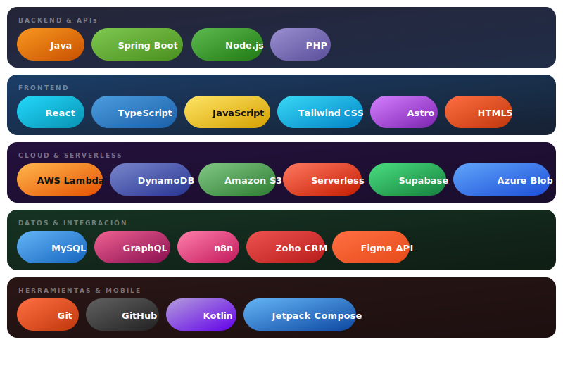

<!--
  Thomas Castro · GitHub Profile README
  Fullstack Engineer · Bogotá, Colombia
-->

 

&nbsp;

&nbsp;

&nbsp;

 

---

## ◈ &nbsp;Sobre mí

Ingeniero de software en formación con experiencia real en entornos productivos, tanto en el sector bancario como en el judicial. Construyo interfaces modernas con React y TypeScript, servicios REST con Java y Spring Boot, y arquitecturas serverless en AWS. Me adapto rápido a nuevas tecnologías, entrego con calidad y siempre planifico antes de escribir la primera línea de código.

> *"Primero el plan. Luego el código."*

 

---

## ◈ &nbsp;Tecnologías

> 💡 **Instrucción:** Sube el archivo `tech_badges.svg` (incluido en este repo) a la raíz de tu repositorio de perfil (`ThomasCastro2005`) junto con este README.

 

---

## ◈ &nbsp;Experiencia

<table width="100%">
<tr>
<td width="140px" valign="top" align="center">

**Jul 2024** **— Dic 2024**

</td>
<td valign="top">

### Rama Judicial &nbsp;·&nbsp; Analista de Gestión Documental y Soporte Tecnológico

Implementé interfaces internas con **React JS** para gestión documental, integrando formularios dinámicos con validaciones robustas. Consumí servicios RESTful desde el frontend y trabajé en la subsanación de índices manuales y adecuación del sistema SGDE. Apoyé capacitaciones sobre el gestor documental a usuarios internos.

`React JS` &nbsp;`REST APIs` &nbsp;`Gestión documental` &nbsp;`SGDE`

</td>
</tr>
<tr><td colspan="2"> </td></tr>
<tr>
<td width="140px" valign="top" align="center">

**Jul 2023** **— Jun 2024**

</td>
<td valign="top">

### Banco Popular &nbsp;·&nbsp; Desarrollador de Software Aprendiz

Desarrollé y mantuve servicios REST con **Java y Spring Boot** en entorno productivo bancario. Diseñé interfaces de usuario con **React JS y Tailwind CSS** orientadas a la experiencia del cliente interno. Realicé migración de bases de datos, adecuación de código en Visual Basic, pruebas funcionales y de punta a punta, e integración de frontend y backend mediante **APIs REST y GraphQL**.

`Java` &nbsp;`Spring Boot` &nbsp;`React JS` &nbsp;`Tailwind CSS` &nbsp;`GraphQL` &nbsp;`MySQL` &nbsp;`Git`

</td>
</tr>
</table>

 

---

## ◈ &nbsp;Educación

| Período | Institución | Título |
|:---|:---|:---|
| En curso · 7mo sem. | Universidad Politécnico Grancolombiano | Ingeniería de Software |
| 2023 – 2025 | SENA | Tecnólogo en Análisis y Desarrollo de Software |
| 2022 | Universidad de Pereira · Misión TIC | Fundamentos de Programación y Tecnologías Digitales |
| 2020 – 2022 | SENA | Técnico en Análisis y Desarrollo de Software |

 

---

## ◈ &nbsp;Certificaciones

| Certificado | Plataforma | Año |
|:---|:---:|:---:|
|  &nbsp;Serverless Framework en AWS | Platzi | 2026 |
|  &nbsp;Claude Code in Action | Anthropic | 2026 |
|  &nbsp;Claude AI | Platzi | 2026 |
|  &nbsp;Automatizaciones Low-Code con n8n | Platzi | 2026 |
|  &nbsp;Supabase | Platzi | 2026 |

 

---

## ◈ &nbsp;Proyectos destacados

### Sistema de Catálogo Digital · Windmar Home
Reemplaza las comunicaciones semanales por correo del equipo de ventas con un catálogo interno digital, integrado con la API de Figma para gestión de assets de diseño y con DynamoDB/S3 para persistencia.
`React` · `TypeScript` · `AWS Lambda` · `DynamoDB` · `S3` · `Figma API`

---

### Módulo de Confirmación de Entregas · Smart-Track (Android)
Módulo offline-first de confirmación de entregas con subida de evidencias, detección de lotes por ruta, compresión de imágenes y tolerancia a fallos. Implementado con WorkManager para operaciones en segundo plano.
`Kotlin` · `Jetpack Compose` · `Apollo Client` · `GraphQL` · `ObjectBox` · `Azure Blob Storage`

---

### Pipeline Meta Lead Ads → Zoho CRM
Integración serverless de captura de leads desde Meta Ads hacia Zoho CRM con deduplicación en DynamoDB, verificación HMAC-SHA256, flujo OAuth 2.0 e idempotencia garantizada.
`AWS Lambda` · `Serverless Framework` · `DynamoDB` · `Zoho CRM` · `TypeScript`

---

### Sistema de Cotización de Techos
Cotizador multi-paso con formulario dinámico, gestión de estado global y resultados en modal.
`React` · `React Hook Form` · `Nanostores` · `Astro` · `TypeScript`

 

---

## ◈ &nbsp;GitHub Stats

> ⚠️ **Reemplaza `ThomasCastro2005` con tu username real de GitHub en las 3 URLs de abajo**

  

 

---

*Bogotá, Colombia &nbsp;·&nbsp; abierto a colaborar en proyectos con impacto real*

